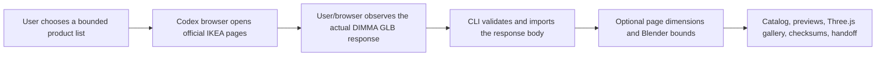

# Ikea-model-collector

> [!WARNING]
> This independent, unofficial project contains **no IKEA models or downloadable model URL catalog**. It is intended only for user-directed personal research, learning, and non-commercial experiments. It grants no right to scrape, redistribute, publish, host, sell, or commercially use IKEA material. Check the current terms for your IKEA site and jurisdiction before use.

An Agent Skill and zero-dependency Node.js CLI for turning IKEA 3D responses that a user has observed in a browser into verified, local-only research collections. It validates GLB files, preserves product provenance and dimensions, optionally renders consistent Blender thumbnails, and produces indexes, a Three.js gallery, checksums, acquisition reports, and a handoff.

IKEA is a trademark of Inter IKEA Systems B.V. This project is not affiliated with, sponsored by, approved by, or endorsed by IKEA.

[简体中文](README.zh-CN.md) · [Agent Skills specification](https://agentskills.io/specification) · [Codex Skills documentation](https://developers.openai.com/codex/skills)

## Workflow



The browser is the discovery and capture surface. The CLI is the validation and collection boundary. The tool never guesses a DIMMA URL from an article number and does not provide unattended crawling.

## What it produces

- Strict IKEA product and DIMMA model URL validation, GLB v2 header/length checks, a 256 MiB streaming limit, at most three manual redirects, atomic publication, SHA-256 deduplication, and idempotent imports.
- An optional `ikea_product_capture.v1` record containing visible product facts, raw and normalized dimensions, locale, article number, variant, source URL, and capture time.
- Optional Blender `orthographic-shadow-v5` thumbnails: an isometric orthographic camera, light gray-white studio, Cycles lighting, and a physical soft contact shadow.
- Searchable catalog data, category indexes, attempt records, rights manifest, checksums, a pinned Three.js viewer, validation report, and human-readable handoff.
- Explicit records for unavailable, failed discovery, failed capture, and failed validation—so a candidate list remains auditable.
- Candidate provenance is independent from physical-file deduplication: two products sharing one SHA-256 retain two acquisition records and one immutable GLB.

## Examples


*A local research workflow using collected assets. Product designs, names, trademarks, and model-derived imagery remain the property of their respective rightsholders.*


*A derived contact sheet demonstrating the optional `orthographic-shadow-v5` preview style. No GLB or individual model artifact is distributed in this repository.*


*An application example: locally arranged 3D furniture can support room-planning and visualization experiments. Rights in depicted third-party products remain with their respective owners.*

For a broader home-design application example, see [OpenHome3D](https://github.com/yuyou-dev/OpenHome3D). OpenHome3D's CC0 assets and IKEA-controlled material handled locally by this tool are **different licensing pools** and must not be treated as interchangeable.

## Requirements

- Node.js 22 or newer.
- A browser capable of saving the response body of an IKEA 3D-viewer request. Codex's in-app browser is the primary workflow; other agents can use a user-provided local GLB.
- Blender is optional and needed only for physical thumbnails and geometry bounds.

The CLI has no runtime npm dependencies. The generated viewer pins Three.js 0.180.0 and its Draco decoder from jsDelivr; thumbnails and indexes remain locally browsable offline, while interactive model loading requires those pinned viewer files to be reachable unless you vendor them yourself.

## Install the Skill

### Project-level Codex configuration

Copy the complete Skill directory—not only `SKILL.md`—into your repository:

```bash
mkdir -p <repo>/.agents/skills
cp -R .agents/skills/ikea-model-collector <repo>/.agents/skills/
```

Codex discovers project skills from `.agents/skills`. A project-level copy is the recommended choice when collection policy and outputs should travel with a repository.

### Global Agent Skills configuration

Copy or link the complete directory into the portable global location:

```bash
mkdir -p ~/.agents/skills
cp -R .agents/skills/ikea-model-collector ~/.agents/skills/
```

Codex also supports its managed personal skill directory (normally `~/.codex/skills`). The built-in `$skill-installer` installs GitHub-hosted skills there; ask it to install:

```text
https://github.com/yuyou-dev/Ikea-model-collector/tree/main/.agents/skills/ikea-model-collector
```

Restart Codex after installing. When the same skill name exists in multiple scopes, keep only the intended version active or prefer the project copy for repository-specific work. Upgrade by replacing the whole directory so scripts and references stay in sync.

## Use with Codex

Example prompts:

```text
$ikea-model-collector Collect the 3D model for this IKEA product into a local research collection, record its visible dimensions, render a thumbnail, and prepare a handoff.
```

```text
$ikea-model-collector Process these five IKEA product URLs serially. Record every unavailable or failed candidate, then finalize and validate the collection.
```

The Skill asks for explicit terms acknowledgment, uses the browser to observe the actual model response, prefers importing its saved response body, and runs the completion gate before declaring a collection ready.

## CLI quick start

Run from the project where the local collection should live:

```bash
CLI=.agents/skills/ikea-model-collector/scripts/ikea-model-collector.mjs

node "$CLI" init \
  --collection-id living-room-study \
  --locale en-US \
  --terms-url https://www.ikea.com/us/en/customer-service/terms-conditions/ \
  --acknowledge-terms

node "$CLI" add \
  --collection-id living-room-study \
  --source-file /path/to/browser-response.glb \
  --capture-file /path/to/ikea-product-capture.json

node "$CLI" record-attempt \
  --collection-id living-room-study \
  --product-url https://www.ikea.com/us/en/p/example/ \
  --result model_unavailable

node "$CLI" render --collection-id living-room-study
node "$CLI" finalize --collection-id living-room-study
node "$CLI" validate --collection-id living-room-study
node "$CLI" show --collection-id living-room-study
node "$CLI" serve --collection-id living-room-study --port 8765
```

After installing or linking this package, the same commands are exposed as `ikea-model-collector`. In a cloned development checkout, `npm link` provides that short command; the explicit Node entry above is always unambiguous.

Example capture file:

```json
{
  "schemaVersion": "ikea_product_capture.v1",
  "name": "Example product",
  "articleNumber": "000.000.00",
  "variant": "color / size",
  "locale": "en-US",
  "productUrl": "https://www.ikea.com/us/en/p/example/",
  "modelUrl": "https://web-api.ikea.com/dimma/assets/example/model.glb",
  "capturedAt": "2026-08-10T00:00:00.000Z",
  "dimensions": {
    "pageRaw": ["Width: 80 cm", "Depth: 40 cm", "Height: 75 cm"],
    "normalizedMeters": {"width": 0.8, "depth": 0.4, "height": 0.75},
    "source": "product-page-visible-text"
  }
}
```

Unknown dimensions should be omitted, never estimated. Geometry bounds are recorded separately and the source GLB is never silently rescaled.

## Collection contract

By default, output stays under the current project:

```text
.ikea-model-collector/collections/<collection-id>/
├── assets/
├── metadata/
├── previews/
├── catalog.json
├── catalog.csv
├── acquisition_report.json
├── license_manifest.csv
├── checksums.sha256
├── gallery.html
├── handoff.md
└── validation_report.json
```

Read the detailed [download contract](.agents/skills/ikea-model-collector/references/download-contract.md), [browser capture guide](.agents/skills/ikea-model-collector/references/browser-capture.md), [collection schema](.agents/skills/ikea-model-collector/references/collection-schema.md), and [legal boundaries](.agents/skills/ikea-model-collector/references/legal-boundaries.md).

## Legal and ethical boundary

Apache-2.0 applies only to this repository's original code and documentation. It does not apply to IKEA models, textures, product imagery, product designs, trademarks, trade dress, or other third-party material. See [NOTICE](NOTICE).

The [IKEA U.S. Terms & Conditions](https://www.ikea.com/us/en/customer-service/terms-conditions/) state an effective date of May 1, 2026 and describe limited personal, non-commercial use of a single copy of site material while restricting copying, distribution, and scraping without written permission. This project does not interpret those terms as blanket authorization to download or reuse 3D assets. You must review the current terms for the exact locale and intended use yourself.

## Development

```bash
npm install
npm run check
uv run --with pyyaml python /path/to/skill-creator/scripts/quick_validate.py \
  .agents/skills/ikea-model-collector
uvx --from skills-ref agentskills validate \
  .agents/skills/ikea-model-collector
```

See [CONTRIBUTING.md](CONTRIBUTING.md), [SECURITY.md](SECURITY.md), and the live [launch checklist](docs/launch-checklist.md). CI runs Node tests, Skill validation, and a repository audit that rejects model assets, archives, likely credentials, machine-local paths, and unexpectedly large files.

## License

Original code and documentation: [Apache License 2.0](LICENSE). Third-party rights and visual exclusions: [NOTICE](NOTICE).
