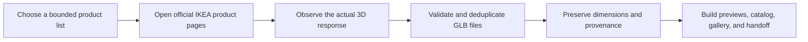

# IKEA Model Collector

[简体中文](README.zh-CN.md) · [Install guide](docs/install.md) · [CLI reference](docs/cli-reference.md) · [Agent Skills specification](https://agentskills.io/specification)

Turn IKEA 3D responses that you have opened in a browser into a verified, searchable, local research library—with an Agent Skill doing the careful work.

`IKEA product page → observed 3D response → validated GLB → dimensions and provenance → previews, catalog, gallery, and handoff`

> IKEA product models remain subject to IKEA's current terms and any applicable rights. Use this project only for an authorized purpose such as research or learning. Do not publish or redistribute downloaded models by default.

This is an independent, unofficial project. IKEA is a trademark of Inter IKEA Systems B.V.; this project is not affiliated with or endorsed by IKEA.

## Start in 60 seconds

The easiest method is to paste this into Codex or another coding agent:

```text
Install the IKEA Model Collector Skill from
https://github.com/yuyou-dev/Ikea-model-collector
into this project, verify the installation, then tell me how to invoke it.
```

Codex users can also ask the built-in Skill installer directly:

```text
$skill-installer Install the Skill from
https://github.com/yuyou-dev/Ikea-model-collector/tree/main/.agents/skills/ikea-model-collector
```

If you prefer one command, run this from the project that should receive the Skill:

```bash
npx --yes github:yuyou-dev/Ikea-model-collector install --project .
```

For a personal Codex installation shared across projects:

```bash
npx --yes github:yuyou-dev/Ikea-model-collector install --personal
```

Existing installations are never replaced silently; add `--force` when you intentionally want to update one. See the [installation guide](docs/install.md) for other agents and manual installation.

## From a product page to a usable asset library



The browser is the discovery surface; the CLI is the validation boundary. The collector never guesses model URLs from article numbers and never turns a bounded task into unattended crawling.

| Capability | What it adds |
|---|---|
| Agent-native workflow | Codex guides discovery, capture, validation, preview generation, and completion checks. |
| Verifiable assets | GLB v2 validation, declared-length checks, SHA-256 identity, atomic publication, and idempotent imports. |
| Useful real-world context | Visible page dimensions remain separate from Blender geometry bounds, so neither source is silently rewritten. |
| Library-quality output | Searchable metadata, category indexes, consistent thumbnails, a local Three.js gallery, and checksums. |
| Auditable handoff | Every success, duplicate, unavailable product, and failure remains visible in the final report. |

## Use it

Start a new conversation in the receiving project and ask:

```text
$ikea-model-collector Collect the 3D model from this IKEA product page into a
local research collection. Preserve visible dimensions and source evidence,
render a thumbnail, then validate and summarize the collection.
```

The agent will guide the browser-observed acquisition flow. A typical run is:

1. You confirm the relevant IKEA terms and intended use.
2. You or the agent open an IKEA product page and activate its 3D view.
3. The browser session captures the model response that was actually observed.
4. The Skill validates and stores the GLB inside the current project.
5. It records product metadata, provenance, dimensions, failures, and hashes.
6. It optionally renders previews and builds a local catalog and gallery.

## Showcase: from collection to application

### Browse a real local asset library


*A dense, searchable furniture library built from local collection records. Product designs, names, trademarks, and model-derived imagery remain with their respective rightsholders.*

### Generate consistent review previews


*A derived contact sheet using the optional studio-preview workflow. It makes scale, silhouette, materials, and collection consistency easier to review without distributing the underlying models.*

### Continue into Home3D-style spatial design


*A Home3D-style room-planning experiment showing how locally organized 3D assets can support layout studies and downstream visualization.*

For a broader home-design application, see [OpenHome3D](https://github.com/yuyou-dev/OpenHome3D). OpenHome3D's CC0 assets and IKEA-controlled material handled locally by this collector are **separate licensing pools** and must not be treated as interchangeable.

## What you get

Collections live under:

```text
.ikea-model-collector/collections/<collection-id>/
```

Each finalized collection can include:

- validated local GLB files and SHA-256 checksums;
- product-page and observed-response provenance;
- catalog JSON/Markdown and attempt history;
- dimension evidence and a rights manifest;
- Blender thumbnails and a local Three.js gallery;
- a validation report and human-readable handoff.

No IKEA model, texture, cache, credential, or per-product preview is included in this repository. The screenshots above are expressly permitted showcase composites only.

## Advanced use

The Skill normally operates the CLI for you. Developers who need direct commands can use the [CLI reference](docs/cli-reference.md). The acquisition rules are documented in the [download contract](.agents/skills/ikea-model-collector/references/download-contract.md), [browser capture guide](.agents/skills/ikea-model-collector/references/browser-capture.md), [collection schema](.agents/skills/ikea-model-collector/references/collection-schema.md), and [legal boundaries](.agents/skills/ikea-model-collector/references/legal-boundaries.md).

## Contributing

Requires Node.js 22 or newer. To verify a checkout:

```bash
npm ci
npm run check
```

CI runs tests, Skill validation, and a repository audit that rejects model assets, archives, likely credentials, machine-local paths, and unexpectedly large files. See [CHANGELOG.md](CHANGELOG.md), [CONTRIBUTING.md](CONTRIBUTING.md), [SECURITY.md](SECURITY.md), and the [release checklist](docs/release-checklist.md).

Code is licensed under Apache-2.0. That license applies to this repository's code and documentation, not to third-party product assets collected by users.
