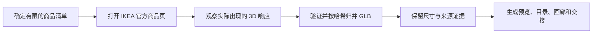

# IKEA 模型收集器

[English](README.md) · [安装说明](docs/install.zh-CN.md) · [CLI 参考](docs/cli-reference.md) · [Agent Skills 规范](https://agentskills.io/specification)

把你已经在浏览器中打开的 IKEA 3D 响应，整理成经过验证、可搜索的本地研究资料库——繁琐的工作交给 Codex 等智能体完成。

`IKEA 商品页 → 浏览器实际观察到的 3D 响应 → 验证 GLB → 尺寸与来源 → 预览、目录、画廊和交接说明`

> IKEA 商品模型仍受 IKEA 当前条款及相关权利约束。请仅在已获授权的研究、学习等用途下使用。默认不要公开发布或再分发下载的模型。

这是一个独立、非官方项目。IKEA 是 Inter IKEA Systems B.V. 的商标；本项目与 IKEA 没有关联，也未获得其背书。

## 60 秒开始使用

最简单的方法是把下面这段话发给 Codex 或其他编程智能体：

```text
请从 https://github.com/yuyou-dev/Ikea-model-collector
把 IKEA Model Collector Skill 安装到当前项目，验证安装结果，
然后告诉我如何在新对话中调用它。
```

Codex 用户也可以直接调用内置 Skill 安装器：

```text
$skill-installer 请安装：
https://github.com/yuyou-dev/Ikea-model-collector/tree/main/.agents/skills/ikea-model-collector
```

如果希望自己执行一条命令，请在目标项目目录中运行：

```bash
npx --yes github:yuyou-dev/Ikea-model-collector install --project .
```

如果希望安装为 Codex 个人 Skill，让多个项目都能使用：

```bash
npx --yes github:yuyou-dev/Ikea-model-collector install --personal
```

安装器不会静默覆盖已有版本；确认需要更新时再加 `--force`。其他智能体和手动安装方法见[安装说明](docs/install.zh-CN.md)。

## 从商品页到可用资产库



浏览器负责发现，CLI 负责验证和收口。收集器不会根据货号猜测模型地址，也不会把一个有限任务扩展成无人值守爬取。

| 能力 | 带来的价值 |
|---|---|
| 智能体原生工作流 | Codex 引导发现、捕获、验证、预览生成和完成检查。 |
| 可验证资产 | GLB v2 与声明长度检查、SHA-256 身份、原子写入和幂等导入。 |
| 可用的真实尺度 | 页面尺寸与 Blender 几何包围盒分别保存，不静默篡改任何证据。 |
| 资产库级输出 | 可搜索元数据、分类索引、统一缩略图、本地 Three.js 画廊和校验和。 |
| 可审计交接 | 成功、重复、无模型和失败商品都会进入最终报告，不会被悄悄遗漏。 |

## 使用方式

安装后，在目标项目的新对话中发送：

```text
$ikea-model-collector 请把这个 IKEA 商品页中的 3D 模型整理到本地研究集合，
保留页面尺寸和来源证据，生成缩略图，最后完成验证并汇总结果。
```

智能体会引导你完成浏览器观察式采集。典型流程是：

1. 你确认适用的 IKEA 条款与用途。
2. 你或智能体打开 IKEA 商品页并触发 3D 视图。
3. 浏览器会话捕获实际观察到的模型响应。
4. Skill 验证 GLB，并把它保存在当前项目内。
5. Skill 记录商品信息、来源、尺寸、失败原因和哈希。
6. 可选生成预览、本地目录和 Three.js 画廊。

## 案例：从收集到实际应用

### 浏览真实的本地资产目录


*由本地集合记录构建的高密度、可搜索家具目录。商品设计、名称、商标及模型衍生图像的相关权利仍归各自权利人所有。*

### 生成一致的审查预览


*通过可选的棚拍预览流程生成联系表，方便统一检查尺度、轮廓、材质和集合一致性；底层模型不会随本仓库分发。*

### 进入 Home3D 空间设计与效果探索


*一个 Home3D 风格的房间布局研究案例，展示本地整理的 3D 资产如何支持空间规划和后续可视化。*

更完整的家居设计应用案例可查看 [OpenHome3D](https://github.com/yuyou-dev/OpenHome3D)。OpenHome3D 的 CC0 资产，与本工具在本地处理的 IKEA 权利内容属于**两个独立许可池**，不得混同。

## 输出内容

集合默认保存在：

```text
.ikea-model-collector/collections/<collection-id>/
```

完成后的集合可以包含：

- 经过验证的本地 GLB 与 SHA-256 校验和；
- 商品页及浏览器观察到的响应来源；
- JSON/Markdown 目录和尝试记录；
- 尺寸证据与权利清单；
- Blender 缩略图和本地 Three.js 画廊；
- 验证报告与人类可读的交接说明。

本开源仓库不包含任何 IKEA 模型、贴图、缓存、凭据或单品预览；以上截图仅为获准展示的合成示例。

## 进阶使用

通常由 Skill 代你操作 CLI。需要直接使用命令的开发者可查看 [CLI 参考](docs/cli-reference.md)。采集边界详见[下载合同](.agents/skills/ikea-model-collector/references/download-contract.md)、[浏览器捕获](.agents/skills/ikea-model-collector/references/browser-capture.md)、[集合结构](.agents/skills/ikea-model-collector/references/collection-schema.md)与[法律边界](.agents/skills/ikea-model-collector/references/legal-boundaries.md)。

## 参与开发

需要 Node.js 22 或更新版本。验证本地检出：

```bash
npm ci
npm run check
```

CI 会运行测试、Skill 校验和仓库审计，阻止模型资产、压缩包、疑似凭据、本机绝对路径和异常大文件进入仓库。参见 [CHANGELOG.md](CHANGELOG.md)、[CONTRIBUTING.md](CONTRIBUTING.md)、[SECURITY.md](SECURITY.md)和[发布检查表](docs/release-checklist.md)。

代码采用 Apache-2.0。该许可证只覆盖本仓库的代码与文档，不覆盖用户采集的第三方商品资产。
