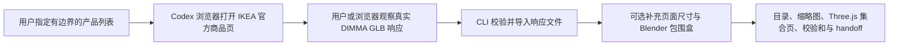
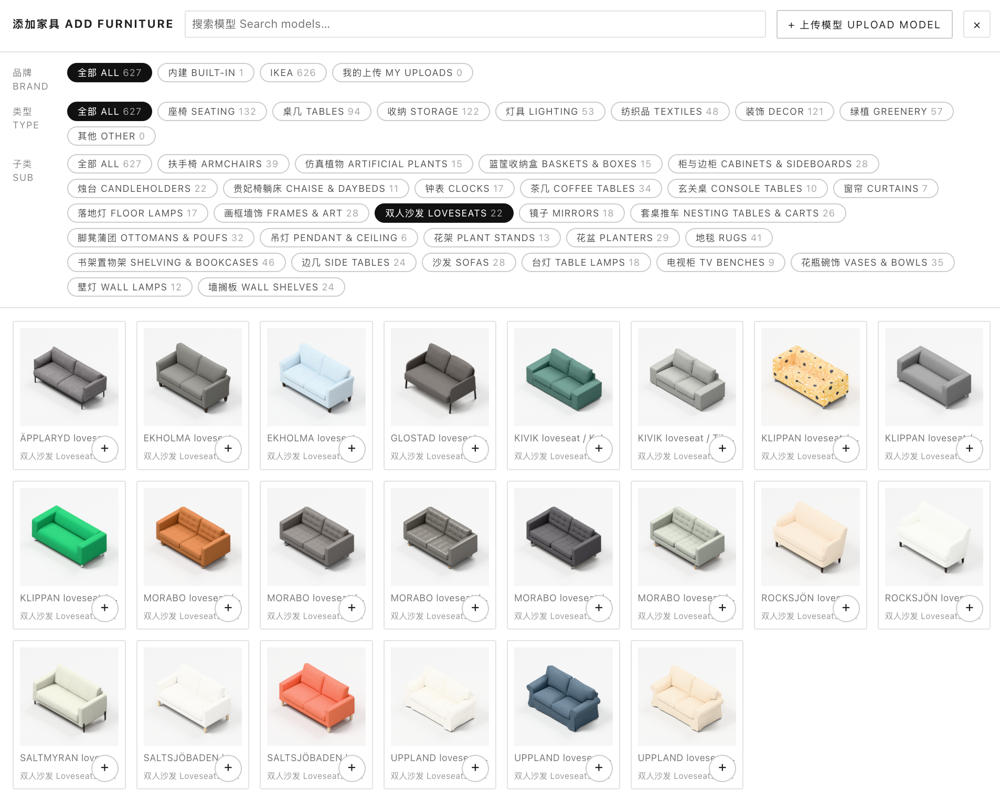
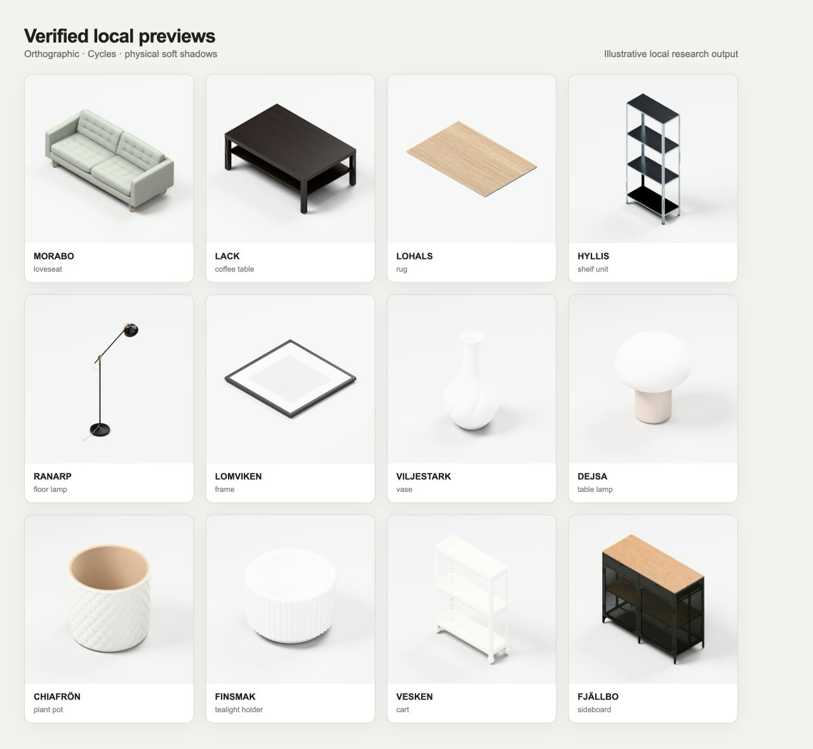
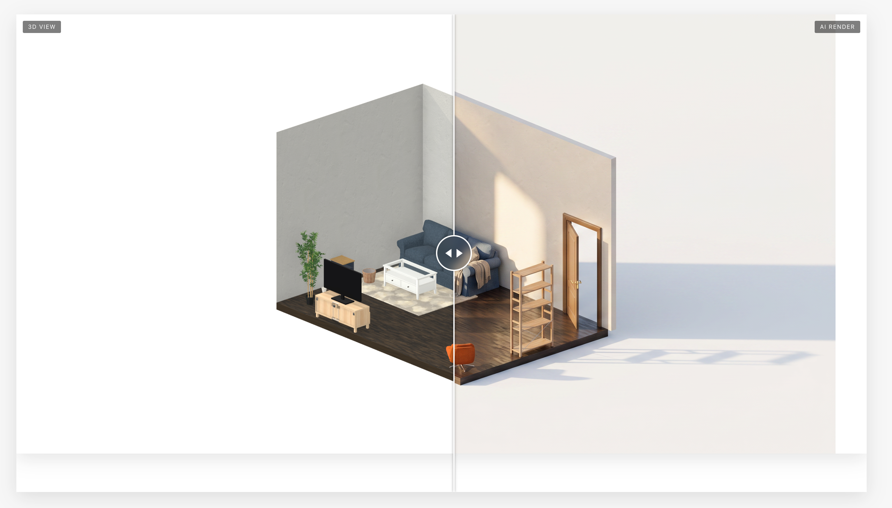

# Ikea-model-collector

> [!WARNING]
> 这是一个独立、非官方项目，仓库中**不包含任何 IKEA 模型，也不提供可下载模型 URL 目录**。本工具仅面向用户主动发起的个人研究、学习和非商业实验，不授予批量抓取、再分发、发布、托管、销售或商业使用 IKEA 材料的权利。使用前请自行检查对应地区 IKEA 网站的最新条款。

这是一个 Agent Skill 和零运行时 npm 依赖的 Node.js CLI：把用户在浏览器中真实观察到的 IKEA 3D 响应整理为经过验证的本地研究集合。它能够校验 GLB、保留商品来源与尺寸信息、可选渲染统一的 Blender 缩略图，并生成索引、Three.js 集合页、校验和、采集报告与 handoff。

IKEA 是 Inter IKEA Systems B.V. 的商标。本项目与 IKEA 无关联，也未获得 IKEA 的赞助、批准、认可或背书。

[English](README.md) · [Agent Skills 规范](https://agentskills.io/specification) · [Codex Skills 文档](https://developers.openai.com/codex/skills)

## 工作流



浏览器负责发现和捕获，CLI 是验证和入库边界。本工具不会根据货号猜测 DIMMA URL，也不提供无人值守爬虫。

## 能力与交付

- 严格校验 IKEA 商品 URL 与 DIMMA 模型 URL；验证 GLB v2 文件头与声明长度；单文件流式上限 256 MiB；最多 3 次手动重定向；原子发布、SHA-256 去重和幂等导入。
- 可选的 `ikea_product_capture.v1`：保存页面可见商品信息、原始及归一化尺寸、locale、货号、变体、来源 URL 和捕获时间。
- 可选 Blender `orthographic-shadow-v5` 缩略图：等轴测正交相机、浅灰白影棚、Cycles 灯光与物理软接触阴影。
- 可搜索目录、分类索引、失败记录、权利清单、校验和、固定版本 Three.js 预览、验证报告及人读 handoff。
- 对“无模型、发现失败、捕获失败、验证失败”分别留痕，确保候选清单可审计。
- 候选来源与物理文件去重彼此独立：两个商品即使共享同一 SHA-256，也会保留两条 acquisition 记录和一份不可变 GLB。

## 效果示例



*本地研究流程示例。图中产品设计、名称、商标及模型衍生图像的权利归各自权利人所有。*



*由本地流程生成的 `orthographic-shadow-v5` 预览组图。仓库不分发任何 GLB 或单项模型产物。*



*应用场景示例：本地排列的 3D 家具可用于空间规划与可视化实验。图中第三方产品的相关权利仍归其权利人所有。*

更完整的家居空间设计应用示例可参考 [OpenHome3D](https://github.com/yuyou-dev/OpenHome3D)。OpenHome3D 的 CC0 资产与本工具在本地处理的 IKEA 受控材料属于**不同授权体系**，不能混为一谈。

## 环境要求

- Node.js 22 或更高版本。
- 能够保存 IKEA 3D 查看器响应文件的浏览器。首选 Codex 内置浏览器；其他 Agent 可使用用户提供的本地 GLB。
- Blender 为可选项，仅在生成物理缩略图和几何包围盒时需要。

CLI 没有运行时 npm 依赖。生成的查看器固定使用 Three.js 0.180.0 及其 jsDelivr Draco 解码器；缩略图和索引可离线浏览，交互式模型加载则需要能够访问这些固定前端文件，除非用户自行本地化它们。

## 安装 Skill

### Codex 项目级安装

把完整 Skill 目录复制到项目中，不要只复制 `SKILL.md`：

```bash
mkdir -p <repo>/.agents/skills
cp -R .agents/skills/ikea-model-collector <repo>/.agents/skills/
```

Codex 会从 `.agents/skills` 发现项目 Skill。当采集规则和输出约定需要随项目共同维护时，推荐使用项目级安装。

### 全局 Agent Skills 安装

把完整目录复制或链接到通用全局位置：

```bash
mkdir -p ~/.agents/skills
cp -R .agents/skills/ikea-model-collector ~/.agents/skills/
```

Codex 也支持其托管的个人 Skill 目录（通常为 `~/.codex/skills`）。内置 `$skill-installer` 会把 GitHub Skill 安装到该位置；可让它安装：

```text
https://github.com/yuyou-dev/Ikea-model-collector/tree/main/.agents/skills/ikea-model-collector
```

安装后重启 Codex。如果同名 Skill 同时存在于多个作用域，请只启用目标版本；仓库专属任务优先使用项目副本。升级时应整体替换目录，避免脚本与 references 版本错位。

## 在 Codex 中使用

示例提示词：

```text
$ikea-model-collector 把这个 IKEA 商品的 3D 模型整理进本地研究集合，记录页面可见尺寸，渲染缩略图并生成 handoff。
```

```text
$ikea-model-collector 串行处理这 5 个 IKEA 商品 URL。记录所有无模型或失败候选，然后 finalize 并 validate 集合。
```

Skill 会要求显式确认条款，通过浏览器观察真实模型响应，优先导入已保存的响应文件，并在完成前执行完整门禁。

## CLI 快速开始

在希望保存本地集合的项目目录中执行：

```bash
CLI=.agents/skills/ikea-model-collector/scripts/ikea-model-collector.mjs

node "$CLI" init \
  --collection-id living-room-study \
  --locale en-US \
  --terms-url https://www.ikea.com/us/en/customer-service/terms-conditions/ \
  --acknowledge-terms

node "$CLI" add \
  --collection-id living-room-study \
  --source-file /path/to/browser-response.glb \
  --capture-file /path/to/ikea-product-capture.json

node "$CLI" record-attempt \
  --collection-id living-room-study \
  --product-url https://www.ikea.com/us/en/p/example/ \
  --result model_unavailable

node "$CLI" render --collection-id living-room-study
node "$CLI" finalize --collection-id living-room-study
node "$CLI" validate --collection-id living-room-study
node "$CLI" show --collection-id living-room-study
node "$CLI" serve --collection-id living-room-study --port 8765
```

安装或链接这个 npm package 后，也可直接使用 `ikea-model-collector` 命令。在克隆的开发仓库中可运行 `npm link` 获得短命令；上面的显式 Node 入口始终最明确。

产品捕获文件示例：

```json
{
  "schemaVersion": "ikea_product_capture.v1",
  "name": "Example product",
  "articleNumber": "000.000.00",
  "variant": "color / size",
  "locale": "en-US",
  "productUrl": "https://www.ikea.com/us/en/p/example/",
  "modelUrl": "https://web-api.ikea.com/dimma/assets/example/model.glb",
  "capturedAt": "2026-08-10T00:00:00.000Z",
  "dimensions": {
    "pageRaw": ["Width: 80 cm", "Depth: 40 cm", "Height: 75 cm"],
    "normalizedMeters": {"width": 0.8, "depth": 0.4, "height": 0.75},
    "source": "product-page-visible-text"
  }
}
```

未知尺寸应省略，不能猜测。几何包围盒单独记录，绝不为“匹配尺寸”而静默缩放原始 GLB。

## 集合契约

默认输出固定在当前项目下：

```text
.ikea-model-collector/collections/<collection-id>/
├── assets/
├── metadata/
├── previews/
├── catalog.json
├── catalog.csv
├── acquisition_report.json
├── license_manifest.csv
├── checksums.sha256
├── gallery.html
├── handoff.md
└── validation_report.json
```

详细约定见[下载契约](.agents/skills/ikea-model-collector/references/download-contract.md)、[浏览器捕获说明](.agents/skills/ikea-model-collector/references/browser-capture.md)、[集合 schema](.agents/skills/ikea-model-collector/references/collection-schema.md)和[法律边界](.agents/skills/ikea-model-collector/references/legal-boundaries.md)。

## 法律与伦理边界

Apache-2.0 只覆盖本仓库的原创代码与文档，不覆盖 IKEA 模型、纹理、商品图、产品设计、商标、商业外观或其他第三方材料。详见 [NOTICE](NOTICE)。

[IKEA 美国站 Terms & Conditions](https://www.ikea.com/us/en/customer-service/terms-conditions/) 标注 2026 年 5 月 1 日生效，其中描述了对单份网站材料有限的个人非商业使用，并限制复制、分发及未经书面许可的抓取。本项目不把这些条款解释为下载或复用 3D 资产的普遍授权。用户必须自行核对具体地区、具体站点与具体用途的最新条款。

## 开发与验证

```bash
npm install
npm run check
uv run --with pyyaml python /path/to/skill-creator/scripts/quick_validate.py \
  .agents/skills/ikea-model-collector
uvx --from skills-ref agentskills validate \
  .agents/skills/ikea-model-collector
```

请阅读 [CONTRIBUTING.md](CONTRIBUTING.md)、[SECURITY.md](SECURITY.md) 和实时更新的[发布 checklist](docs/launch-checklist.md)。CI 会执行 Node 测试、Skill 校验和仓库禁入审计，拒绝模型文件、压缩包、疑似凭据、本机绝对路径及异常大文件。

## 许可证

原创代码与文档采用 [Apache License 2.0](LICENSE)。第三方权利与视觉材料排除见 [NOTICE](NOTICE)。
